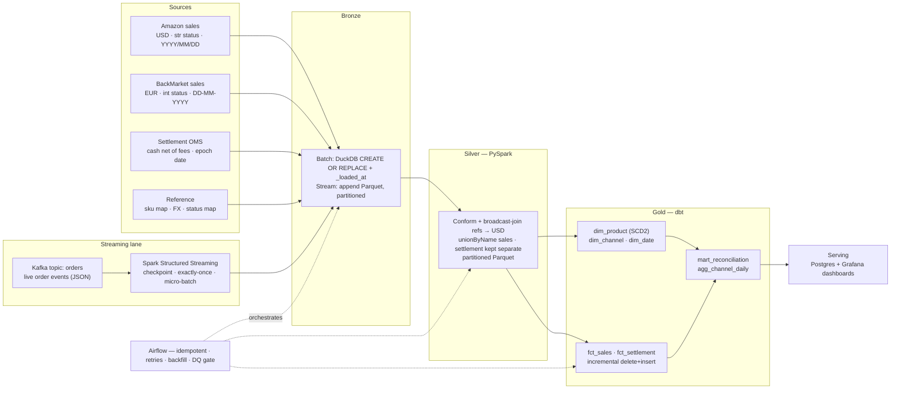
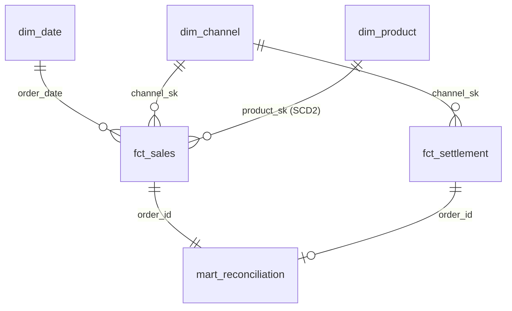
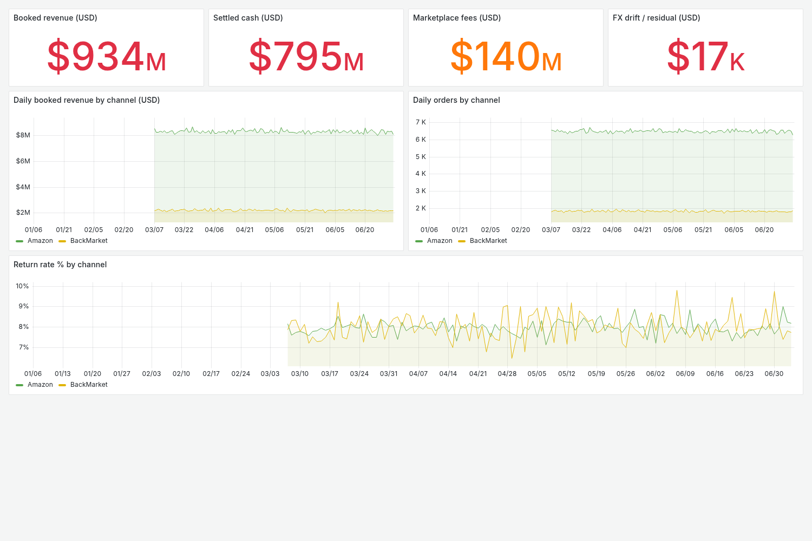

# Commerce Lakehouse — end-to-end medallion data platform

[](https://github.com/uyentrang27/commerce-lakehouse/actions/workflows/ci.yml)
&nbsp;PySpark · dbt · DuckDB · Kafka · Spark Structured Streaming · Apache Airflow · Postgres · Grafana · Docker

A medallion lakehouse for a multi-channel reseller: raw ingestion → **Bronze** →
**Silver (PySpark)** → **Gold (dbt star schema)** → serving, orchestrated by
**Apache Airflow**, with a **Kafka → Spark Structured Streaming** lane landing
live order events into the same Bronze zone — *one lakehouse, two ingestion
speeds*. Its centre of gravity is the hard part of real commerce data:
**conforming several sources that speak different languages**, and **reconciling
booked sales revenue against the cash actually settled**. It covers dimensional
modelling, SCD Type 2, incremental processing, join/partition optimisation,
data-quality gates, streaming ingestion and idempotent orchestration end to end.



> **Scale:** runs on **1,000,000 sales** (≈78% one channel — a deliberate skew)
> plus **~740k settlements** on a laptop, `--scale`-configurable higher. It is a
> synthetic **portfolio simulation of a common industry pattern** — the
> engineering is the point, not the specific numbers or any real company's system.

## The problem

A refurbished-phone reseller sells through several online marketplaces and
settles cash through an order-management system. Nothing lines up out of the box:

- Each **sales channel** speaks its own language — different column names, order
  **status codes** (`"Shipped"` vs `3`), **currency** (USD vs EUR) and **date
  formats** (`2026/06/29` vs `29-06-2026`), and its own **product codes**.
- The **settlement** feed is a *different grain* — one row per cash remittance,
  net of marketplace and shipping **fees** — so it can't just be stacked onto
  sales.
- Finance needs to know not only *what was sold* but *how much cash actually came
  back*, and why the two differ (fees, FX, orders not yet paid out).

## What it delivers

- **One conformed sales table across channels** — codes mapped to a canonical
  product id, statuses standardised, every amount converted to USD, then unioned,
  so every report agrees on the numbers.
- **Sales-vs-cash reconciliation** — `mart_reconciliation` ties booked revenue to
  settled cash per order, exposing **fees**, **FX drift** between sale and payout,
  and **revenue booked but not yet collected**.
- **Correct history (SCD2)** — product price and refurbished grade changes are
  versioned, so "as-of" analysis stays accurate.
- **Efficient at scale** — incremental facts + pre-aggregated tables mean cheaper
  compute and faster dashboards.
- **Trustworthy numbers** — a data-quality gate and idempotent loads keep bad or
  duplicated data out of serving.

## How it works, layer by layer

| Layer | Tool | What it does |
|---|---|---|
| **Bronze** | DuckDB | Idempotent `CREATE OR REPLACE` load of every raw file + `_loaded_at` audit — a queryable, replayable landing zone. |
| **Silver** | **PySpark** | **Conform** each source to one schema (rename, cast messy dates, map codes); **broadcast joins** against the tiny reference tables — sku map, status map, FX — so the million-row fact never shuffles; **FX to USD**; **`unionByName`** the two conformed sales channels; keep settlement separate (different grain); **cache** the reused frame; **`coalesce`** file-sizing; **partition by `order_date`** for pruning. |
| **Gold** | **dbt** | **Star schema** (facts + conformed dims, surrogate keys); **SCD Type 2** snapshot (product price + grade history); **incremental** facts (`delete+insert`, only the delta); **`mart_reconciliation`** (booked vs settled); **aggregation table** for fast BI; tests + exposure + lineage. |
| **Orchestration** | **Airflow** | Idempotent stages, retries with backoff, backfill-ready `@daily`, a **DQ gate** that fails the run before bad data reaches serving, and orchestrator/data-stack **env isolation**. |
| **Serving** | **Postgres + Grafana** | Gold marts published to a Postgres serving DB; Grafana dashboards (datasource + dashboard provisioned as code) show channel performance and sales-vs-cash reconciliation. All on Linux — see Serving. |

## Why joins happen at Silver (conform) vs Gold (model)

- **Silver joins to *conform*** — map each channel's product code to a canonical
  `product_id`, translate status codes, convert currency. Without this the sources
  can't be compared, let alone unioned.
- **Silver keeps different *grains* apart** — sales (one row per order) and
  settlement (one row per cash remittance) are **not** unioned; they are two
  clean tables.
- **Gold joins to *model*** — the star schema (surrogate keys, SCD2) and the
  order-level reconciliation between the two facts.

## Streaming lane (Kafka → Spark Structured Streaming → Bronze)
The batch lane loads marketplace exports on a schedule. The streaming lane models
the *same domain* arriving live: a producer emits one JSON event per order onto a
Kafka topic, and a **Spark Structured Streaming** job lands them into the **same
Bronze zone** as append-partitioned Parquet. One lakehouse, two ingestion speeds;
the streamed events are the same shape Silver already conforms.

```bash
make stream-demo        # start Kafka (Docker) → produce 500 events → drain to Bronze → done
# or step by step:
make stream-up          # single-node Kafka (KRaft) on localhost:9092
make stream-produce EVENTS=500 RATE=200
make stream-consume     # Spark drains the topic into data/bronze_stream/orders
make stream-down
```

What it demonstrates:
- **`readStream` from Kafka** → parse the JSON payload against an explicit schema,
  keep Kafka `partition`/`offset` as lineage, stamp `_ingested_at`, partition by
  `event_date`.
- **Checkpointing = fault tolerance + exactly-once to the file sink.** The
  checkpoint records the Kafka offsets already committed, so a restart resumes
  where it stopped and a re-run processes only new offsets.
- **Micro-batch, honestly.** Structured Streaming is micro-batch. `--mode batch`
  uses the `availableNow` trigger (drain everything on the topic, then stop) —
  deterministic and CI-friendly; `--mode continuous` runs on a fixed interval
  like a real deployment.

Verified idempotency: produced **500** events → drained → Bronze holds 500;
produced **300** more → re-ran the same job → Bronze holds **800**, of which
**800 are distinct `event_id`** — the checkpoint skipped the already-committed
500, no duplicates.

## Data model (Gold star schema)

- `fct_sales` — grain: one row per sold order (incremental), conformed from both channels.
- `fct_settlement` — grain: one row per cash remittance (incremental).
- `dim_product` — **SCD Type 2**: price + grade history via a dbt snapshot.
- `dim_channel`, `dim_date` — conformed dimensions.
- `mart_reconciliation` — order-grain booked-vs-settled: fees, FX drift, uncollected cash.
- `agg_channel_daily` — daily rollup a dashboard hits instead of the raw fact.

## Benchmark — incremental vs full rebuild
Appending one new day and refreshing `fct_sales`, measured on this machine
(1.02M sales total, 20k-order daily delta):

| Refresh | Rows processed | Wall time |
|---|---|---|
| **Incremental** (`dbt run`) | 20,000 (1 day) | **13.2 s** |
| **Full rebuild** (`--full-refresh`) | 1,020,000 (all history) | 17.5 s |

Incremental only touches the new partition. The gap **widens with history depth**
— on a multi-year fact a full rebuild scans everything while incremental still
processes just the day. (At this scale dbt's ~3 s CLI start-up is a large part of
the incremental time; the SQL delta itself is sub-second.)

## Run it

### With Docker (no local Python/Java/Spark needed)
The whole stack — PySpark, dbt, DuckDB — is baked into one image, so the
pipeline runs the same way on any machine and in CI.
```bash
docker compose run --rm pipeline               # default 200k-order run
SCALE=1000000 docker compose run --rm pipeline  # full 1M-order run
```
It runs generate → bronze → silver(Spark) → dbt snapshot/run/test → **validate**
(the data-quality gate), and exits non-zero if any dbt test or DQ check fails.
The Gold warehouse (DuckDB) and Silver Parquet persist in named volumes for
inspection or the serving layer.

### With a local venv (fastest for iterating)
```bash
make install          # create .venv + install the data stack
make pipeline         # generate → bronze → silver → dbt (snapshot/run/test) → validate
make benchmark        # incremental vs full-refresh timing
make scd2-demo        # mutate the product master + re-snapshot → SCD Type 2 history
```

### Via Airflow
```bash
make airflow          # standalone UI at http://localhost:8080
# unpause + trigger the `commerce_lakehouse` DAG
```
Airflow runs in its own venv (`.venv-airflow`) and shells out to the data-stack
venv via `BashOperator` — the orchestrator/runtime **env isolation** a real
deployment enforces.

## Continuous integration
Every push runs [`.github/workflows/ci.yml`](.github/workflows/ci.yml):
- **lint** — `ruff` over `scripts/`, `spark/`, `benchmark/`, `dags/`, `streaming/`, `serving/`.
- **pipeline** — provisions Java 17 + Python 3.12, then runs the full medallion
  pipeline at a small scale including **all 23 dbt tests** and the **DQ gate**.
  A broken transform or a failing quality check turns the build red.

## Serving (Postgres + Grafana)
The Gold marts are published to a **Postgres serving DB**, which **Grafana** reads
natively — the datasource and dashboard are **provisioned as code** under
`serving/grafana/`, so the serving layer stands up reproducibly on Linux (no
Power BI / Windows needed).

```bash
make serving-demo   # Postgres + Grafana (Docker) + publish Gold marts
# open http://localhost:3000  (anonymous viewer) → "Commerce Lakehouse — Serving"
make serving-down
```



The dashboard (`serving/grafana/dashboards/commerce_lakehouse.json`) shows, from
`agg_channel_daily` and `mart_reconciliation`:
- the **reconciliation waterfall** — booked revenue → marketplace fees → FX drift
  → settled cash (stat panels);
- **daily booked revenue** and **orders by channel** (time series);
- **return rate %** by channel.

`serving/load_to_postgres.py` does the publish: it attaches the DuckDB warehouse
read-only and Postgres as the write target (DuckDB's `postgres` extension), then
replaces each serving table. The dbt `exposure` `grafana_reconciliation_dashboard`
records the dependency in the lineage.

## Project layout
```
commerce-lakehouse/
├── scripts/
│   ├── gen_multisource.py    # synthetic multi-source data (vectorised, skewed)
│   ├── ingest_bronze.py      # raw → DuckDB bronze (idempotent)
│   ├── validate.py           # data-quality gate on Gold
│   └── run_pipeline.py       # run all stages without Airflow
├── spark/silver_transform.py # PySpark conform + union + settlement (broadcast, FX, partition)
├── dbt/                       # Gold: staging → snapshot (SCD2) → marts (star, incremental, reconciliation)
├── streaming/                 # Kafka producer + Spark Structured Streaming → Bronze
│   ├── produce_orders.py      #   live order-event producer (kafka-python)
│   └── stream_to_bronze.py    #   readStream Kafka → parse → checkpointed Parquet
├── serving/                   # Postgres serving DB + Grafana (provisioned as code)
│   ├── load_to_postgres.py    #   publish Gold marts DuckDB → Postgres
│   └── grafana/               #   datasource + dashboard provisioning
├── dags/commerce_lakehouse_dag.py  # Airflow orchestration
├── benchmark/benchmark_incremental.py
├── Dockerfile · docker-compose.yml # reproducible data-stack image + one-command run
├── docker-compose.streaming.yml    # single-node Kafka (KRaft) for the streaming lane
├── docker-compose.serving.yml      # Postgres + Grafana for the serving lane
├── .github/workflows/ci.yml   # lint + full-pipeline CI (dbt tests + DQ gate)
├── Makefile · ruff.toml        # task runner + lint config
└── docs/                      # serving dashboard screenshot
```

## Engineering decisions & challenges
The interesting parts weren't the happy path — they were these calls:

- **Conform *then* union, but only within a grain.** The two sales channels are
  translated to one schema and `unionByName`-d; settlement is a *different grain*
  (one row per cash remittance) so it is **kept separate** and reconciled at Gold,
  not stacked onto sales. Unioning across grains would double-count revenue.
- **Broadcast joins to survive skew.** One channel is ~78% of volume. Mapping
  codes → canonical ids by shuffling the million-row fact would hot-spot on the
  dominant key; instead the tiny reference tables (sku/status/FX) are
  **broadcast**, so the fact never shuffles. The skew is deliberately built into
  the generator as a talking point.
- **Incremental facts via `delete+insert`, keyed on the natural id.** Appending
  would duplicate on re-run/backfill. Delete-then-insert on `unique_key` makes
  each load **idempotent** — re-running a day is a no-op, which is what makes
  retries and backfill safe.
- **SCD Type 2 through a dbt snapshot**, so product price/grade history is
  versioned and "as-of" analysis stays correct — validated by a check that
  exactly one `is_current` row exists per product.
- **FX drift is real, so the DQ gate is tolerance-based, not exact.** Booked
  revenue is valued on the *sale* date; cash settles on the *payout* date, so
  same-currency (USD) orders reconcile to the cent while EUR orders show a small,
  bounded gap. `validate.py` flags only settled orders whose gap exceeds **5% of
  booked** — catching genuine breaks without failing on legitimate FX timing.
- **A real orchestration bug worth remembering.** `BashOperator.env` is a
  *templated* field with `template_ext=('.sh','.bash')`, so passing the full
  environment broke the DAG when an outer shell exported `GIT_ASKPASS=…/askpass.sh`
  — Airflow tried to load that value as a Jinja template (`TemplateNotFound`). Fix:
  pass only the two vars the pipeline needs and set `append_env=True`
  (see [`dags/commerce_lakehouse_dag.py`](dags/commerce_lakehouse_dag.py)).
- **Coalesce + partition-by-date on write.** Silver `coalesce`s before writing to
  avoid the small-files problem and partitions by `order_date` so downstream reads
  prune to the days they need.
- **Streaming reuses Bronze, not a parallel universe.** The Kafka lane lands into
  the same Bronze zone rather than a separate pipeline, so batch and stream
  converge at Silver. Exactly-once comes from the Structured Streaming checkpoint
  (offset tracking + file-sink manifest), not hand-rolled dedup.

## Scaling to production
The pattern is warehouse-portable. Swap targets without touching the DAG:
- **DuckDB → Snowflake / Databricks / BigQuery**: change `dbt/profiles.yml` and
  the Silver output sink; the medallion structure, conform logic, SCD2 snapshot
  and incremental models carry over.
- **Local Spark → cluster (Databricks/EMR)**: the Silver job already uses
  broadcast joins, partitioning and file-sizing — the habits that matter at TB
  scale — and the skewed channel is a built-in data-skew talking point.

---
*Portfolio project. Domain and data are synthetic; the architecture simulates a
common multi-source retail data-engineering pattern, not any specific company's
system.*
